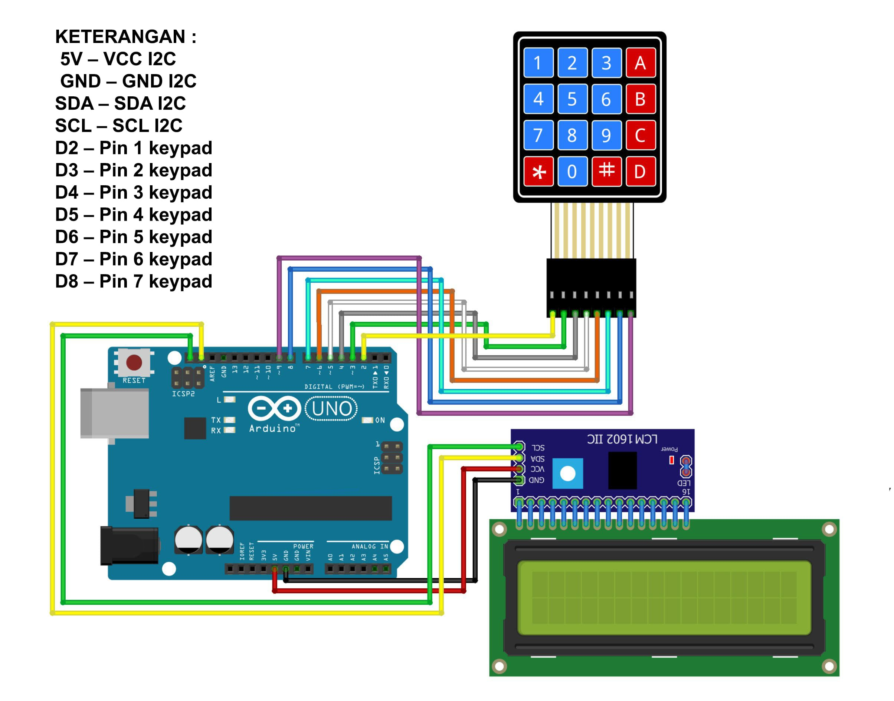

# Arduino Calculator with Keypad 4x4 and LCD Display

This project is an Arduino-based calculator that uses a 4x4 keypad for input and an I2C LCD for output. The calculator can perform basic arithmetic operations such as addition, subtraction, multiplication, and division.

## Description

The project utilizes an Arduino board, a 4x4 matrix keypad, and a 16x2 I2C LCD display. Users can input numbers and select operations using the keypad, and the result is displayed on the LCD screen. The calculator supports basic operations: addition, subtraction, multiplication, and division. The 'C' button clears the current input, while the '=' button calculates and displays the result.

## Components :

- Arduino IDE or VS Code;
- Library I2C LCD;
- Library Keypad;
- Arduino Uno = 1 piece;
- 4x4 Keypad = 1 piece;
- 16x2 I2C = 1 piece;
- 16x2 LCD Display = 1 piece;
- Breadboard = 1 piece;
- Jumper Wires.

# Schematic:

- Below you can see a schematic image to facilitate the wiring of cables from the microcontroller to devices, both input and output sensors:

## Circuit Diagram

Connect the components as follows:

- **Keypad**:
  - Row pins: Arduino pins 2, 3, 4, 5
  - Column pins: Arduino pins 6, 7, 8, 9

- **I2C LCD**:
  - SDA to Arduino A4
  - SCL to Arduino A5
  - VCC to 5V
  - GND to GND

## Features

- **Arithmetic Operations**: Supports addition, subtraction, multiplication, and division.
- **Input Validation**: Displays "Invalid" when attempting to divide by zero.
- **Clear Functionality**: Resets the current input and result using the 'C' button.

## Code Explanation

### Initialization

- The `Keypad` and `LiquidCrystal_I2C` libraries are used to manage keypad input and LCD output, respectively.
- The keypad is initialized with a 4x4 matrix of characters representing numbers and operators.
- The LCD is initialized and prepared for displaying input and results.

### Main Loop

- The program constantly checks for key presses on the keypad.
- **Numbers (0-9)**: Accumulated as the first operand and displayed on the LCD.
- **Operators (+, -, \*, /)**: Trigger the calculation of the current result with the previously entered operand.
- **Equals (=)**: Finalizes the calculation and displays the result.
- **Clear (C)**: Resets the calculator, clearing all stored values and the LCD display.

### Secondary Function

- The `SecondNumber()` function collects the second operand after an operator is selected, enabling the calculation.

## How to Use

1. Power the Arduino and ensure all components are connected properly.
2. Press number keys on the keypad to input the first operand.
3. Press an operator key (+, -, \*, /).
4. Input the second operand and press '=' to display the result.
5. Press 'C' to clear and start a new calculation.

## Example

To calculate `25 + 7`:

1. Press `2`, `5` on the keypad.
2. Press `+`.
3. Press `7`.
4. Press `=` to display the result `32`.

## Notes

- Ensure the keypad and LCD are wired correctly according to the pin configuration.
- The calculator handles simple arithmetic and basic input validation, but more complex calculations may require additional features.
